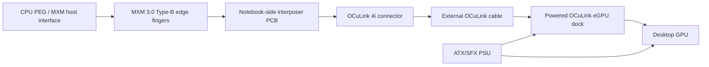
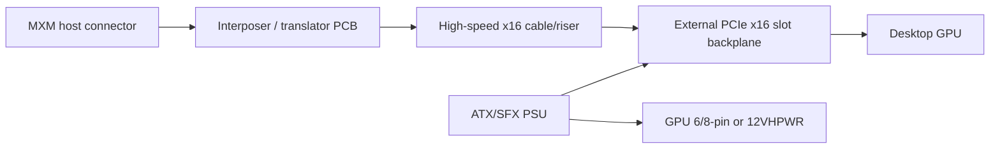

# Architecture

## Recommended architecture: MXM to OCuLink x4

## Why x4 OCuLink first

The MXM slot can theoretically expose up to 16 PCIe lanes, but a first prototype should not try to export all lanes. PCIe Gen3 x16 over a custom laptop-exit cable has high signal-integrity risk. A 4-lane OCuLink path is materially easier to validate and uses existing cable/dock ecosystems.

## Alternative: MXM to PCIe x16 external riser

This is theoretically possible but not recommended for RevA. It requires a custom external backplane, high-quality cable assembly, careful power sequencing, and likely redrivers/retimers for robustness.

## Minimal signal groups

### PCIe high speed

- PETp/n[0..3] from host to device
- PERp/n[0..3] from device to host
- REFCLKp/n

### PCIe control / sideband

- PERST#
- CLKREQ#
- WAKE#
- PRSNT#/detect strap equivalents
- SMBus SCL/SDA, isolated or strap-selectable

### Power / reference

- GND stitching and shield grounding
- 3.3 V sense / low-power pull-up domain only if required
- No GPU slot 12 V drawn from MXM

## Power architecture

The external dock/backplane must provide:

- PCIe slot 12 V
- PCIe slot 3.3 V
- AUX 6/8-pin or 12VHPWR GPU power
- over-current protection
- controlled power-on sequencing

The notebook-side board should avoid taking meaningful power from the MXM slot. Any logic rail should be current-limited and fuse-protected.

## Expected user workflow

1. Power off notebook.
2. Connect OCuLink cable.
3. Power external dock/PSU first.
4. Boot notebook.
5. Check PCIe enumeration.
6. Install GPU driver only after stable enumeration.

Hotplug is explicitly not supported for RevA.
