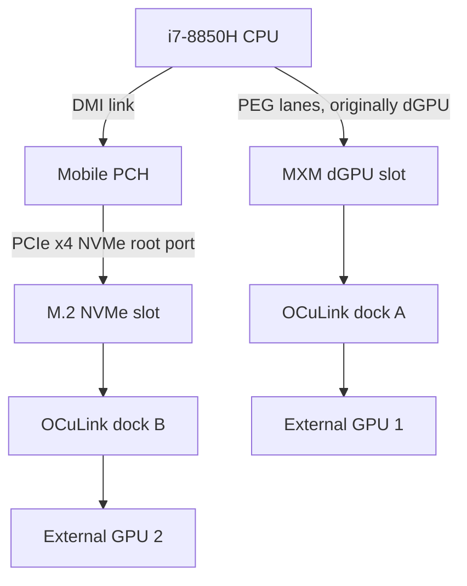

# Dual external GPU feasibility

## Question

Can the ZBook 17 G5 theoretically run two external desktop GPUs, for example:

1. GPU A through M.2 NVMe -> OCuLink x4.
2. GPU B through MXM -> OCuLink x4 or MXM -> PCIe riser.

## Short answer

**Theoretically yes, practically uncertain and not a RevA goal.**

The platform may expose independent PCIe root ports for the CPU PEG/MXM path and PCH/M.2 NVMe path. If firmware enumerates both, Windows/Linux can generally handle multiple GPUs. The hard blockers are firmware behavior, physical integration, power sequencing and driver stability.

## Likely topology

## Bandwidth considerations

- MXM-derived GPU path could be CPU PEG and avoid PCH/DMI bottleneck if firmware exposes it cleanly.
- M.2 NVMe-derived OCuLink path likely traverses the PCH and DMI link.
- Two GPUs doing heavy peer-to-peer or simultaneous host transfers can contend for CPU, memory, DMI and thermal/power management.
- For gaming on one GPU and compute on the other, bandwidth contention may be acceptable.
- For two gaming GPUs, modern multi-GPU rendering is mostly unsupported and not worthwhile.

## Firmware constraints

Potential blockers:

- BIOS may require an HP-recognized MXM module.
- BIOS may not initialize external GPU-like endpoint on MXM without video BIOS expectations.
- BIOS may not support bifurcation of MXM PEG lanes into multiple devices.
- M.2 port may not support hotplug and must see device at boot.
- Boot graphics selection may conflict with external-only paths.

## Driver constraints

- AMD + Nvidia mixed drivers are usually possible but can be messy.
- Nvidia CMP cards may be compute-only/no-display and better suited to CUDA workloads.
- AMD eGPU for display plus Nvidia CMP for compute is an attractive theoretical split.
- Anti-cheat and VM passthrough scenarios can add unrelated failure modes.

## Power and mechanical constraints

Two external GPUs require:

- two powered docks or a custom dual-slot external backplane;
- independent PSU capacity;
- safe power sequencing;
- mechanically safe cable exits;
- no load on notebook internal GPU power rails.

## Practical recommendation

1. First validate M.2 -> OCuLink with one GPU.
2. Then validate MXM -> OCuLink x4 as RevA.
3. Only after both are independently stable, attempt simultaneous enumeration.
4. Do not design a dual-GPU board until single-link MXM behavior is proven.

## Best theoretical use case

- External AMD/Nvidia gaming GPU on one link, monitor attached directly.
- One or more Nvidia CMP/compute GPUs in a separate desktop/server or on another dock for CUDA/ComfyUI/Ollama experiments.

## Worst use case

- Two external gaming GPUs for combined rendering. This is not a sensible target because modern games rarely support explicit multi-GPU effectively.
