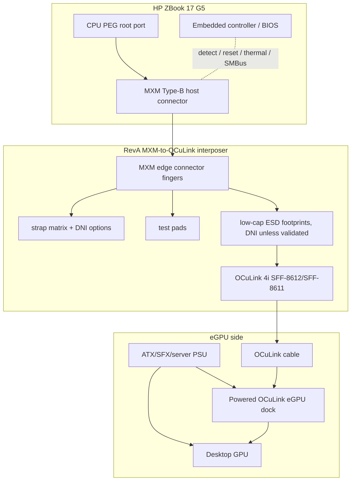

# RevA block diagram: MXM to OCuLink x4

## Board partitions

1. **MXM finger area**: mates with the notebook MXM socket and keeps all high-speed breakout lengths short.
2. **High-speed escape region**: routes PCIe x4 and REFCLK with uninterrupted reference planes.
3. **Sideband strap/test region**: exposes PERST#, CLKREQ#, WAKE#, PRSNT#/detect, SMBus, optional thermal spoof.
4. **Cable connector region**: OCuLink 4i with robust retention and mechanical strain relief.

## Intended mechanical shape

The board should mimic the MXM module insertion edge and occupy the minimum internal volume required to exit an OCuLink cable path. A flex or short cabled OCuLink pigtail may be mechanically easier than a rigid connector placed directly at the MXM area, but this must not violate PCIe Gen3 signal-integrity limits.
